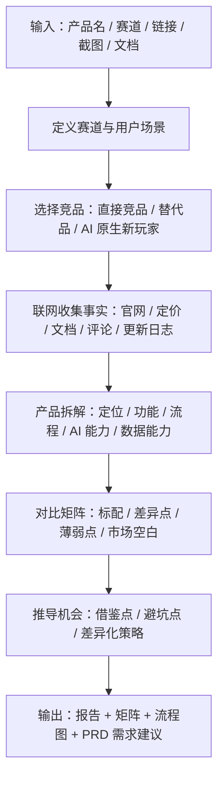
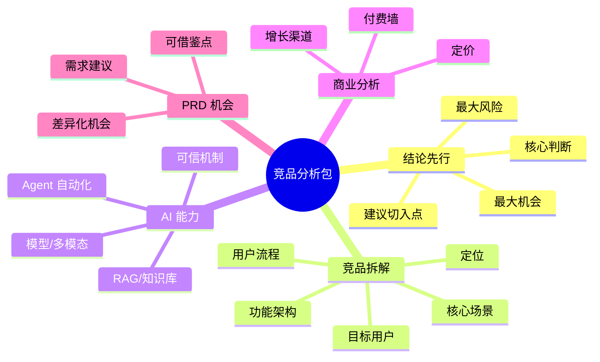

# AI Product Competitive Analysis Skill


面向 AI 产品经理的竞品分析 Skill。它会联网调研 AI 产品、SaaS、App、小程序、Web 工具、内容社区、电商/导购产品等赛道，输出能直接用于立项、PRD、汇报和产品决策的竞品分析材料。

## 一句话

> 把“帮我分析这个产品/赛道/竞品”转成一份结论清晰、来源可追溯、可进入 PRD 的竞品分析包。

## 适合什么输入

| 用户输入 | Skill 会做什么 | 默认产出 |
|---|---|---|
| 一个产品名 | 补充相近竞品作为参照 | 产品拆解 + 横向对比 |
| 一个赛道方向 | 默认调研 5-8 个代表性竞品 | 赛道报告 + 竞品矩阵 |
| 多个竞品链接 | 逐个抓取官网、定价页、文档、更新日志 | 对比分析报告 |
| 应用商店/截图/笔记 | 提炼定位、流程、功能、用户反馈 | 功能拆解与机会点 |
| PRD 前期调研需求 | 将竞品观察转成产品需求建议 | PRD 可用机会点 |

## 工作流



## 默认交付物



## 核心能力

| 能力 | 说明 |
|---|---|
| 联网调研 | 默认联网，优先官方来源、定价页、文档、更新日志 |
| 竞品选择 | 自动补充直接竞品、相邻替代品和 AI 原生产品 |
| 产品拆解 | 覆盖定位、用户、场景、功能、流程、商业模式 |
| AI 能力分析 | 重点看模型、多模态、Agent 深度、RAG、记忆、可信机制 |
| 矩阵输出 | 生成适合飞书/Notion/CSV 的对比矩阵 |
| PRD 转化 | 把竞品发现转成可落地的机会点和需求建议 |
| 来源标注 | 区分事实与推断，关键事实附来源链接 |

## 对比矩阵字段

| 字段 | 说明 |
|---|---|
| 竞品名称 | 产品或公司名称 |
| 官网链接 | 官方入口 |
| 产品定位 | 一句话定位和价值主张 |
| 目标用户 | 核心用户与付费决策者 |
| 核心场景 | 高频使用场景 |
| 核心功能 | 主要功能模块 |
| AI 能力 | 模型、多模态、Agent、自动化能力 |
| RAG / 数据能力 | 数据导入、解析、检索、引用、记忆 |
| 商业模式 | 免费、订阅、按量、企业版等 |
| 定价 | 价格、套餐、付费墙 |
| 增长渠道 | SEO、社区、渠道、应用商店、内容营销 |
| 交互亮点 | UI / UX / Onboarding / 关键流程 |
| 优势 | 可借鉴能力 |
| 劣势 | 可突破或规避的问题 |
| 对我们的机会 | 可进入 PRD 的机会点 |
| 信息来源 | 事实来源链接 |

## 安装

将仓库克隆到 Codex skills 目录：

```bash
git clone https://github.com/dayu-66666/ai-product-competitive-analysis-skill.git ~/.codex/skills/ai-product-competitive-analysis
```

如果你已有同名 skill，可以先备份：

```bash
mv ~/.codex/skills/ai-product-competitive-analysis ~/.codex/skills/ai-product-competitive-analysis.bak
```

## 触发方式

```text
使用 $ai-product-competitive-analysis 分析 AI 穿搭助手赛道，并输出竞品分析报告、对比矩阵、用户流程图和 PRD 可用机会点。
```

也可以直接说：

```text
帮我分析一下 xxx 产品的竞品
```

## 文件结构

```text
.
├── SKILL.md
├── README.md
├── agents
│   └── openai.yaml
└── references
    └── report-template.md
```

## 输出结构

默认输出：

```text
1. 结论先行
2. 赛道与用户场景
3. 竞品选择与理由
4. 竞品概览表
5. 功能与体验拆解
6. AI / 模型 / RAG 能力分析
7. 商业模式与定价分析
8. 用户流程图
9. 对比矩阵
10. 可借鉴点
11. 差异化机会
12. PRD 可用需求建议
13. 风险、未知与下一步调研
14. 信息来源
```

## 质量原则

- 关键事实必须有来源。
- 明确区分事实和推断。
- 不把参数表复制成报告，要写出产品判断。
- 机会点必须能进入 PRD，不只写泛泛建议。
- AI 产品必须分析模型、RAG、数据、Agent 自动化深度和可信机制。

